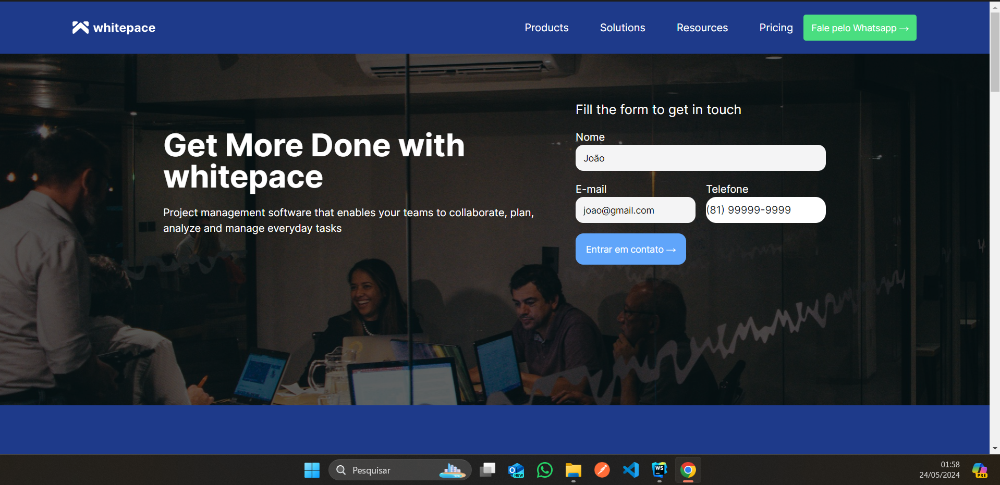
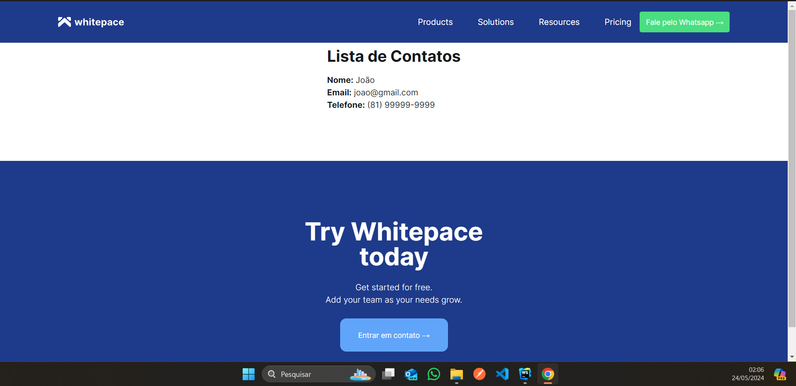

# Landing Page 

Este é um projeto de landing-page simples que inclui um formulário para coletar informações de contato dos usuários. Os dados inseridos no formulário são enviados para um endpoint específico, que neste caso é http://localhost:3000/contacts.





## Como Rodar o Projeto

Para executar o front-end do projeto, siga os seguintes passos:

1. Navegue até o diretório raiz do projeto.
2. Instale as dependências do projeto executando o seguinte comando:
   ```
   npm install
   ```
4. Após a instalação das dependências, execute o seguinte comando para iniciar o servidor de desenvolvimento:
   ```
   npm run dev
   ```
5. Acesse a landing-page em seu navegador através do endereço http://localhost:3000.

Para executar o back-end do projeto, siga os seguintes passos:

1. Certifique-se de ter o Node.js e o npm instalados em sua máquina.
2. Navegue até o diretório `backend` dentro do diretório raiz do projeto.
3. Instale as dependências do backend executando o seguinte comando:
   ```
   npm install
   ```
4. Após a instalação das dependências, execute o seguinte comando para iniciar o servidor:
   ```
   npm run start-backend
   ```

## Como Funciona o Envio de Dados

Quando um usuário preenche o formulário na landing-page e o submete, os dados são enviados para o endpoint http://localhost:3000/contacts no formato JSON. Certifique-se de que o backend esteja em execução para receber os dados corretamente.

